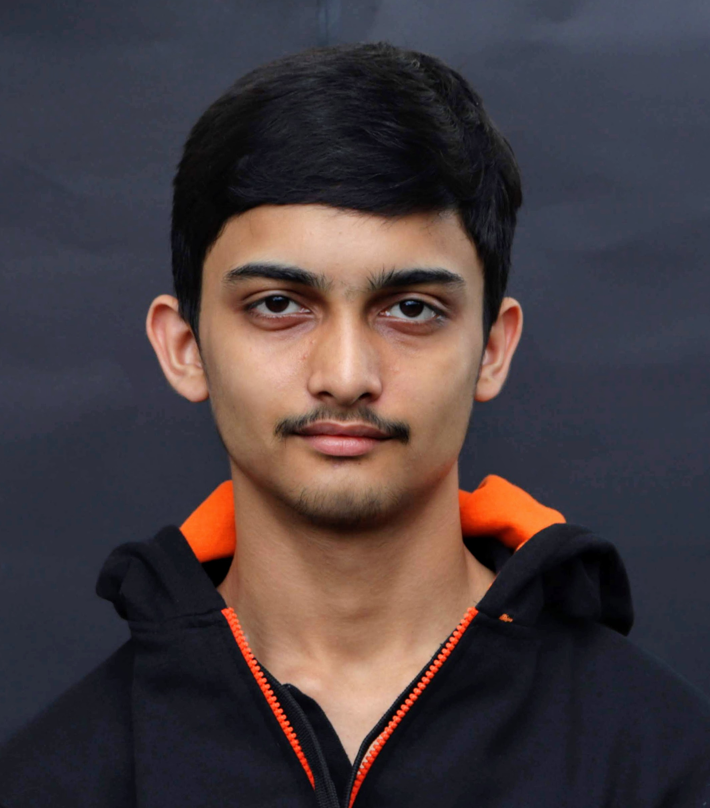

Hi! I'm Chaitanya, a college student currently pursuing a Bachelor's in Computer Science Engineering. I'm a self proclaimed geek, a tinkerer and an open source enthusiast. I'm always looking for new opportunites for using technology to build cool new things that can solve real world problems and help improve the world around me.

 

## Areas of Interest
- Computer Vision
- Natural Language Processing
- Deep learning
- Robotics
- Frugal innovation

