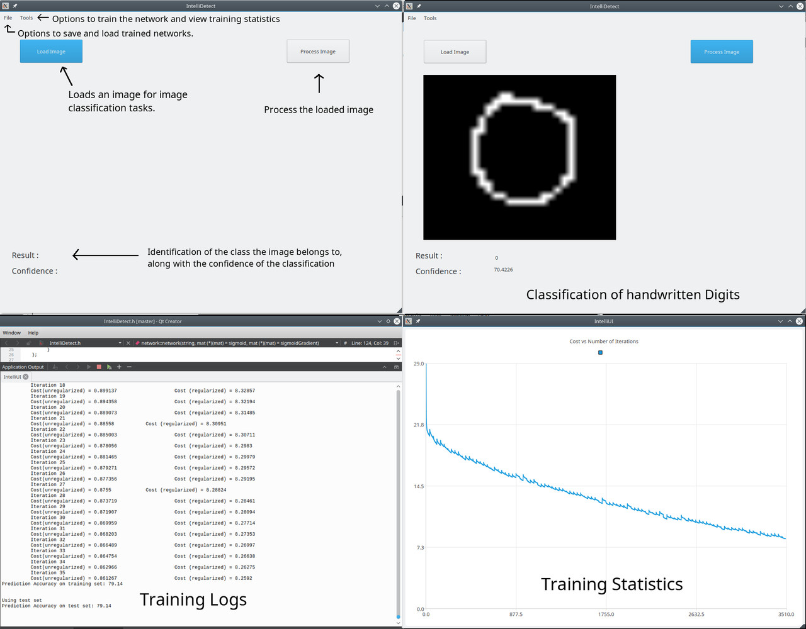
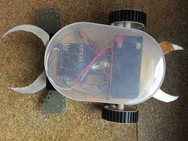
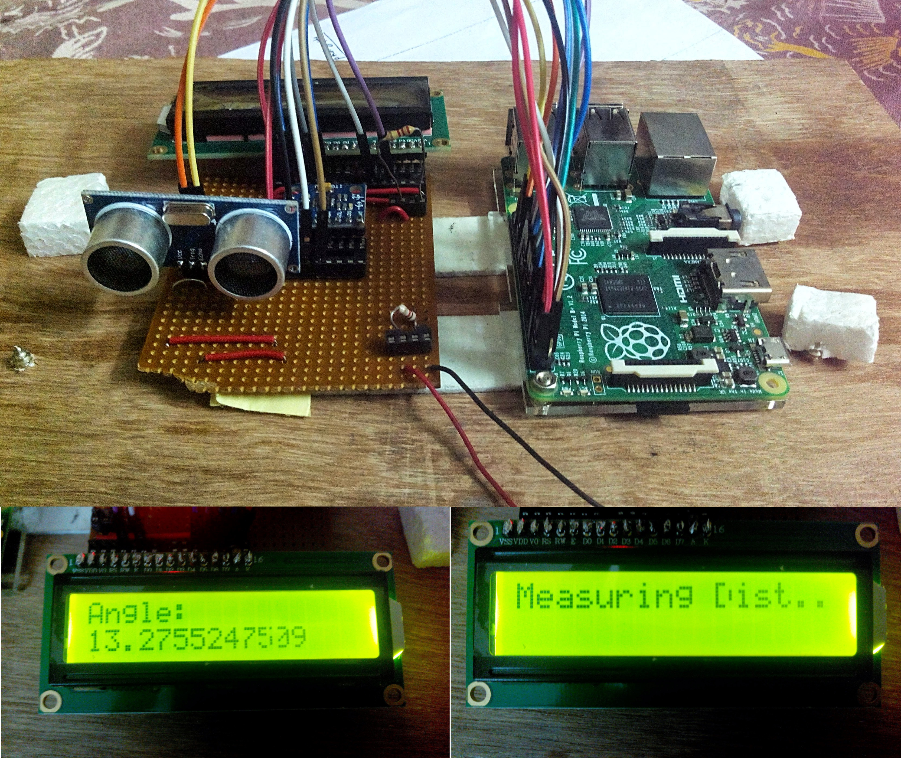

## Notable Projects

### **Solo**: An autonomous unmanned ground vehicle (UGV) capable of navigating obstacle courses
*2019*

Solo is a UGV built by Project Manas for the annual Intelligent Ground Vehicle Competition (IGVC) held at Oakland University, Michigan. Solo helped Project Manas win the IGVC in 2019 and bag many other awards as well. I had loads of fun working on Solo at Project Manas.

### **SAMIS**: A Smartphone based vein imaging system
*2017*\

SAMIS is and android app that uses image processing algorithms to visualize subcutaneous veins in an image of the body of a user taken using a regular smartphone camera. SAMIS utilizes the fact that different wavelengths of light interact in different ways with biological tissue to extract vein information. It is particularly challenging to do on a regular, unmodified smartphone camera because the range of wavelengths of light a smartphone can capture excludes the infrared spectrum, where veins details are simpler to extract. Since IR data is unavailable, SAMIS uses the more subtle variations detectable in the visible spectrum to help visualize vein patterns. SAMIS can potentially be used to help nurses make the process of finding veins for administering Intra-venous injections less error-prone for individuals whose veins are hard to find using conventional methods. SAMIS is potentially useful for diagnosing conditions like varicose veins. Systems like SAMIS, developed on off-the-shelf, easily accessible hardware can bring down the cost of medical diagnostics and allow access to useful tools to doctors and clinics in the less affluent regions of the world. SAMIS was conceptualized and developed by me and my friend Geeve George. SAMIS helped us win the Second Place Grand Award in Biomedical Engineering at Intel International Science And Engineering Fair (ISEF) 2017 at Los Angeles, California. It also helped us win the Grand award at IRIS 2016 science fair, held in Pune.

### **Magniwear**: A Smartphone-based AR/VR microscope

Magniwear is an AR/VR microscope built on the Google Cardboard platform. It allows the user to operate a microscope hands-free using voice commands while wearing it on their head and explore biological samples in a virtual reality environment. This feature makes Magniwear useful as an educational tool, allowing children to explore the microscopic world from a first-person view. It can also function as a dental loupe or as a tool for viewing small samples using the included lens system. Its AR features can help the user highlight useful features better. It also allows streaming what the user sees to other users over the internet, making Magniwear useful during operations other tasks where experts can look at what the user is seeing and provide real-time guidance. I worked on Magniwear with my friend Geeve George and were selected as one of the top 90, globally in the Google Science Fair 2015.

## Open Source Software

### **IntelliDetect**: GUI Tool to train and deploy neural networks
*2016*\

Intellidetect is a GUI tool and a neural network library written in C++ using the QT framework. Intellidetect aims to help individual users train neural networks using the GUI and also load neural networks to perform inference on data points later. IntelliDetect allows the user to specify the network architecture in a configuration file, load it using the GUI and point to a dataset for training. Intellidetect can then take care of creating, training and saving the trained network in a portable format, while also providing the user with a rich set of training statistics and visualizations to monitor the training process and to evaluate the performance of the network. The user is allowed the option of loading a pretrained neural network and using that network for prediction tasks. Intellidetect makes this process as easy as clicking on a 'load' button, selecting the input from the filesystem and clicking on 'predict' to view the prediction within the GUI. I built IntelliDetect with the help of my friend Geeve.

### **CloneLab**: CLI tool to clone GitLab groups 
*2018*\
Gitlab allows grouping repos into folder-like structures called groups. While GitLab groups provide a great way to organize a large project having a large number of modules each maintained as a separate git repo, there is no easy way to clone the entire group in which a project resides. CloneLab provides a way to do just that. CloneLab also supports pulling updates to all repos in a GitLab group at once.

### **ObjectTracker**: Kalman-filter based tracking module to track pre-segmented objects in a video stream.
*2018*\
Given a video stream consisting of object masks as input, ObjectTracker tracks the movement of objects using Kalman filters. This module can handle objects moving in and out of the view frame and dynamically tracks the position and velocity of objects. This object tracking module can additionally take care of small amounts of random noise in object positions as well.

### **Torrid**: Heatwave prediction and notification
*2018*\
Heatwaves are an underrated, invisible threat that can potentially kill thousands of unsuspecting people in a single day. Torrid predicts the onset of a Heatwave before it happens by tracking weather data and can detect an adverse response in the user's body to the extreme heat during a heatwave using a wearable device and automatically call for help if the user is in danger. I built torrid with the help of my friends Dheeraj and Siddharth.

### **Dental Assessment App**: App to automate and digitize the activities of a dental hospital
*2019*\
Hospitals need to file a lot of paperwork and follow a set of procedures tracking the process of providing healthcare to a patient who visits the hospital. A local dental hospital needed to streamline the healthcare delivery process by reducing the effort and paperwork needed to track treatment history, appointments and department visits of incoming patients. As the final project for an iOS course at college I designed and implemented and app for iOS to enable the process with the help of my teammates Arsh and Deepansh.

## Hardware Projects

### **BreatheSafe**: Smart indoor air-quality monitor
*2017*\

BreatheSafe is a low-cost indoor air-quality monitor that uses an Arduino Uno and an MQ-35 gas sensor to monitor the levels of CO2 and other VOCs in its vicinity. Monitoring indoor air quality can help identify issues with ventilation and help people breathe safer. This project won a model-making competition held at St. Aloysius College, Mangalore.

### **Robaldo 2016 bot**: Soccer playing bot
*2016*\

Robaldo was a Robo Soccer Challenge Match by PESIT University, Banglore, where we competed against 68 teams from all over India. Our bot was designed from scratch by my friend Geeve and myself. The bot could be controlled wirelessly using a smartphone connected to the Arduino Uno powering the robot via a Bluetooth connection. The bot could be controlled in either direction (i.e. the forward and reverse directions could be flipped flip by pressing a button) which gave us a tactical advantage that let us reach the Quarterfinals and hold our own against much sturdier bots.

### **Digital Clinometer**
*2015*\

A clinometer is a device that uses the principles of trigonometry to measure the height of buildings and other tall objects without having to climb them. The digital clinometer I built uses a Raspberry Pi as the compute unit and interfaces with an ultrasonic sensor for measuring the distance to the object and with an MPU-6050 accelerometer and gyroscope breakout board to help measure the angle of inclination to its top. The Raspberry Pi then uses this information to compute the height of the object. This project was the very first one that I worked on in the 10th grade. It showed me how much fun learning could be!
